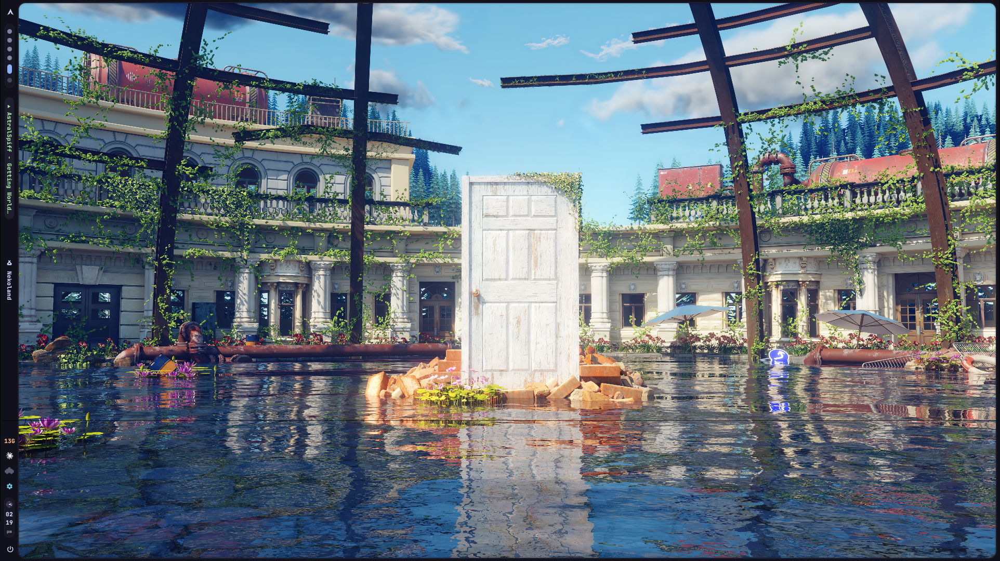

# Nekoland

A hand-built desktop shell and control center for Hyprland, written in C.



Nekoland replaces the usual bar + settings + wallpaper + OSD stack with two
programs that share one design language: an inset "shell chrome" that frames
the screen, Catppuccin Mocha colours, and rounded capsule widgets.

## Parts

### `shell/` — nekobar (GTK3 + gtk-layer-shell)

The shell itself: a thin vertical sidebar on every monitor plus the chrome
that frames the windows.

- **Chrome frame** — a border around the screen with a rounded, inset
  window cutout; panels morph out of it instead of floating over it.
- **App launcher** — phone-style pinned grid (drag to arrange, drop app on
  app to make folders, labelled row dividers), an all-apps drawer with
  search, and per-app context menus. Layout persists.
- **Quick settings** — iOS-style volume capsule, output picker that can
  wake sinks hidden behind card profiles, direct input monitoring
  (per-input PipeWire loopbacks), and a shortcut into the settings app.
- **Context toolbar** — slides down from the top edge:
  - YouTube Music: track + transport controls + a cava spectrum across the
    strip (event-driven via `playerctl --follow`, ~0.2 s to appear).
  - Direct monitoring: mic icon, input name, stop button, same spectrum.
  - VSCodium focused: the strip becomes a File/Edit/… menubar (driven via
    `hyprctl dispatch sendshortcut`) and the music shrinks into a pill on
    the right, with the visualizer squeezed inside it.
- **Volume OSD** — macOS-style pill on the focused monitor when the volume
  changes (keyboard roller etc.).
- **Widgets** — workspace dots, analog + 12-hour clock capsule, memory,
  mpris, tray (StatusNotifier + dbusmenu), SteamVR button (launch / route
  audio to the Index / quit).

### `settings/` — nekoland-settings (GTK4 + libadwaita)

- **Sound** — outputs/inputs with profile-aware entries (e.g. the Valve
  Index hiding behind an inactive HDMI profile), hidden-device management
  shared with the shell.
- **RGB** — native drivers for ENE DRAM (SMBus), NZXT Hue2/Kraken (hidraw),
  Gigabyte GPU (i2c), ASRock Polychrome, Razer, Logitech, with an OpenRGB
  CLI fallback. Profiles, per-LED painting, and continuous state
  persistence to `rgb-state.ini`.
- **Displays** — monitors configured through an embedded Lua file,
  arrangement preview, identify overlay, and Hyprland tearing
  (immediate-mode) window rules with live match counts.
- **Wallpaper** — hyprpaper front-end: per-monitor or global, folder
  watcher, 16:9 thumbnails; persists to `hyprpaper.conf` for login restore.
- **Kraken LCD** — drives the Kraken Plus V2 pump screen natively
  (bucket-less RGB565 protocol), including streamed GIF playback.

Helper binaries built alongside:

| binary | job |
| --- | --- |
| `nekoland-lcdd` | detached daemon that keeps LCD animations running |
| `nekoland-rgb-restore` | headless replay of the saved RGB state at login |
| `nekoland-identify` | monitor-identify overlay (GTK3 layer-shell) |

## Building

```sh
# shell
cd shell && make

# settings + helpers
cd settings && make
```

Dependencies (Arch names): `gtk3 gtk-layer-shell json-glib libdbusmenu-gtk3`
for the shell; `libadwaita json-glib libusb lua5.4` for settings. Runtime
tools: `hyprland hyprpaper pipewire-pulse playerctl cava wpctl grim`.

## Hyprland integration

Autostart (`hyprland.conf`):

```conf
exec-once = ~/SoftwareDevelopment/Nekoland/shell/nekobar
exec-once = ~/SoftwareDevelopment/Nekoland/settings/nekoland-lcdd --restore
exec-once = ~/SoftwareDevelopment/Nekoland/settings/nekoland-rgb-restore
exec-once = hyprpaper
```

Plus layer rules for the shell's surfaces (blur + `ignore_alpha` for the
glass panels, `animation slide top` for the toolbar) and binds for the
launcher (`SUPER+R`) and volume keys. The settings app generates
`monitors-gen.conf` and `tearing-gen.conf`, both sourced from the main
config.

## Note

This is a personal shell, tuned to one machine — a triple-monitor Hyprland
setup with a Steinberg UR22C, a Valve Index, and a case full of RGB. Device
ids, monitor names, and a few protocol quirks are hard-coded where it made
sense. Steal ideas freely; expect to edit before it runs anywhere else.
